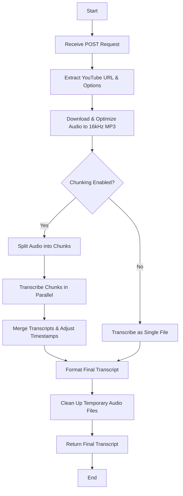

# Project Workflow

This document provides a visual and descriptive overview of the entire workflow for the YouTube Transcription Service. The diagram shows the journey from an initial API request to the final, delivered transcript.

## 🌊 Workflow Diagram

This diagram illustrates the step-by-step process. Each part is explained in more detail below.

---

## 📝 Explanation of the Workflow

1.  **Receive Request:** The workflow begins when the service receives a `POST` request at the `/v1/transcripts` endpoint.

2.  **Extract URL & Options:** The service parses the request to get the YouTube URL and any other options provided, such as `model` or `enableChunking`.

3.  **Download & Optimize Audio:**
    - **`yt-dlp`** and **`ffmpeg`** work together to download the audio and convert it to an **optimized `16kHz mono MP3` file** in a single, efficient step. This avoids storing a large intermediate file and speeds up the process.

4.  **Transcription Strategy:**
    - If the user enables the `enableChunking` option, the service proceeds with a parallel transcription strategy for faster results.
    - Otherwise, it processes the entire audio file at once, which can provide slightly higher accuracy for shorter files.

5.  **Transcribe the Audio (Chunked or Single):**
    - **Chunked:** If enabled, `ffmpeg` splits the audio into smaller, overlapping chunks. These chunks are then sent to the local Python ASR service and transcribed **in parallel**.
    - **Single File:** If chunking is disabled, the entire MP3 file is sent to the Python service for transcription.

6.  **Merge & Format Transcript:**
    - If the audio was chunked, the transcribed text from all chunks is intelligently merged, and timestamps are adjusted to be continuous.
    - The final, unified transcript is formatted into `JSON`, `SRT`, `VTT`, and `TXT`.

7.  **Clean Up:** To save disk space, the service deletes the entire temporary directory created for the job, including the downloaded MP3 file and all audio chunks.

8.  **Return Response:** The final, formatted transcript is sent back to the user in the API response, completing the request.
