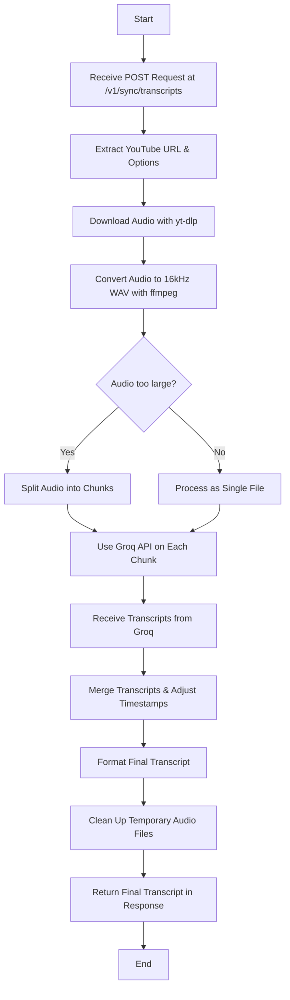
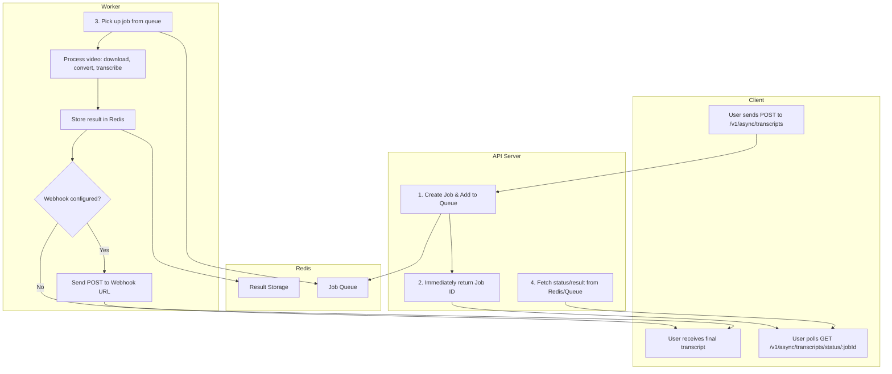

# Project Workflow

This document provides a visual and descriptive overview of the two primary workflows for the YouTube Transcription Service: **Synchronous** and **Asynchronous**.

## 🌊 Synchronous Workflow

This diagram illustrates the simple, blocking process of the synchronous API.

--- 

## 📝 Explanation of the Synchronous Workflow

1.  **Receive Request:** The workflow begins when the service receives a `POST` request at the `/v1/sync/transcripts` endpoint.

2.  **Extract URL & Options:** The service parses the request to get the YouTube URL and any other options provided, such as a specific `model`.

3.  **Download & Convert Audio:**
    - **`yt-dlp`** is used to download the audio from the YouTube URL.
    - **`ffmpeg`** then converts this audio into a standard `16kHz mono WAV` file, which is the ideal format for speech recognition.

4.  **Chunking Decision:** The service checks the size of the WAV file. To improve reliability and handle large files, it may be split into chunks.

5.  **Split Audio (If Needed):** For large files, `ffmpeg` is used to split the audio into smaller, sequential chunks.

6.  **Transcribe the Audio:**
    - Each chunk (or the single file) is sent to the **Groq API** for transcription.
    - The service uses a powerful Whisper model to generate the transcript very quickly.

7.  **Merge & Format Transcript:**
    - If the audio was chunked, the transcribed text from all chunks is intelligently merged.
    - Timestamps are adjusted to be continuous across the full duration of the original audio.
    - The final, unified transcript is formatted into `JSON`, `SRT`, `VTT`, and `TXT`.

8.  **Clean Up:** To save disk space, the service deletes all temporary files created during the process, including the downloaded audio, the converted WAV file, and all audio chunks.

9.  **Return Response:** The final, formatted transcript is sent back to the user in the API response, completing the request.

---

## 🚀 Asynchronous Workflow

This workflow is non-blocking and uses a job queue to process requests in the background. It involves three key components: the **API Server**, a **Worker**, and a **Redis Queue**.

## 📝 Explanation of the Asynchronous Workflow

1.  **Create Job:** The user sends a `POST` request to `/v1/async/transcripts`. The API server creates a job, adds it to the **Redis Queue**, and immediately returns a `jobId` to the user.

2.  **Worker Processing:** A separate **Worker** process, which is constantly listening to the queue, picks up the new job. The worker then performs the heavy lifting: downloading, converting, and transcribing the video.

3.  **Store Result:** Once the transcription is complete, the worker stores the final transcript in **Redis**, using the `jobId` as the key.

4.  **Check Status:** The user can poll the `/v1/async/transcripts/status/:jobId` endpoint at any time. The API server fetches the job's current status from the queue or the final result from Redis and returns it.

5.  **Webhook (Optional):** If a webhook URL is configured, the worker sends a `POST` request with the final transcript to the specified URL as soon as the job is complete.
