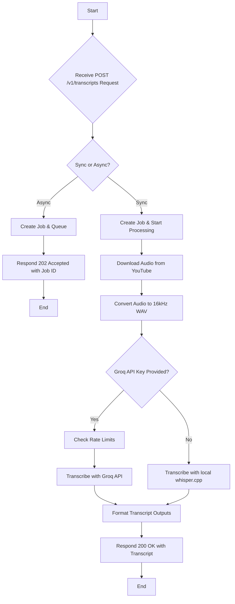

# Project Workflow Diagram

This diagram illustrates the entire workflow of the transcription service, from receiving a request to delivering the final transcript.

```mermaid
graph TD
    A[Start] --> B{Receive POST /v1/transcripts Request};
    B --> C{Sync or Async?};
    C -->|Async| D[Create Job & Queue];
    D --> E[Respond 202 Accepted with Job ID];
    E --> F[End];
    
    C -->|Sync| G[Create Job & Start Processing];
    G --> H[Download Audio from YouTube];
    H --> I[Convert Audio to 16kHz WAV];
    I --> J{Groq API Key Provided?};
    
    J -->|Yes| K[Check Rate Limits];
    K --> L[Transcribe with Groq API];
    L --> M[Format Transcript Outputs];
    
    J -->|No| N[Transcribe with local whisper.cpp];
    N --> M;
    
    M --> O[Respond 200 OK with Transcript];
    O --> P[End];

```
