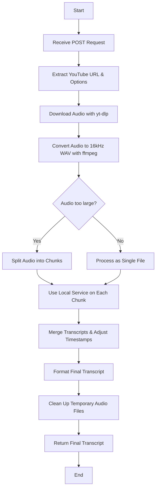

# Project Workflow

This document provides a visual and descriptive overview of the entire workflow for the YouTube Transcription Service. The diagram shows the journey from an initial API request to the final, delivered transcript.

## 🌊 Workflow Diagram

This diagram illustrates the step-by-step process. Each part is explained in more detail below.

--- 

## 📝 Explanation of the Workflow

1.  **Receive Request:** The workflow begins when the service receives a `POST` request at the `/v1/transcripts` endpoint.

2.  **Extract URL & Options:** The service parses the request to get the YouTube URL and any other options provided, such as a specific `model`.

3.  **Download & Convert Audio:**
    - **`yt-dlp`** is used to download the audio from the YouTube URL into a temporary job-specific folder.
    - **`ffmpeg`** then converts this audio into a standard `16kHz mono WAV` file.

4.  **Chunking Decision:** The service checks the size of the WAV file. If it's larger than the configured limit, it proceeds to the chunking step. Otherwise, it treats the file as a single chunk.

5.  **Split Audio (If Needed):** For large files, `ffmpeg` is used to split the audio into smaller, sequential chunks of a configured duration (e.g., 10 minutes).

6.  **Transcribe the Audio:**
    - Each chunk (or the single file) is sent to the local Python ASR service, which uses `faster-whisper` to generate the transcription.

7.  **Merge & Format Transcript:**
    - If the audio was chunked, the transcribed text from all chunks is intelligently merged.
    - Timestamps are adjusted to be continuous across the full duration of the original audio.
    - The final, unified transcript is formatted into `JSON`, `SRT`, `VTT`, and `TXT`.

8.  **Clean Up:** To save disk space, the service deletes the entire temporary directory created for the job, including the downloaded audio, the converted WAV file, and all audio chunks.

9.  **Return Response:** The final, formatted transcript is sent back to the user in the API response, completing the request.
